# Apuntes Marcas y Canales

Fuente  
https://observablehq.com/@uwdata/data-types-graphical-marks-and-visual-encoding-channels?collection=@uwdata/visualization-curriculum

Estilos

### [Spectre (CSS Framework)](https://picturepan2.github.io/spectre/index.html)

# Visualizaciones

## chart_01_x

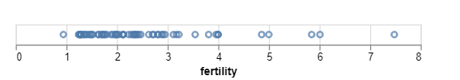

## chart_02_y

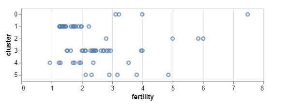

## chart_03_x_y

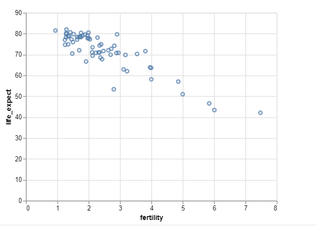

## chart_04_escala

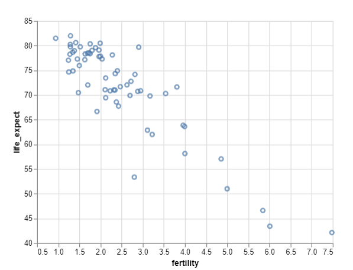

## chart_05_size_a

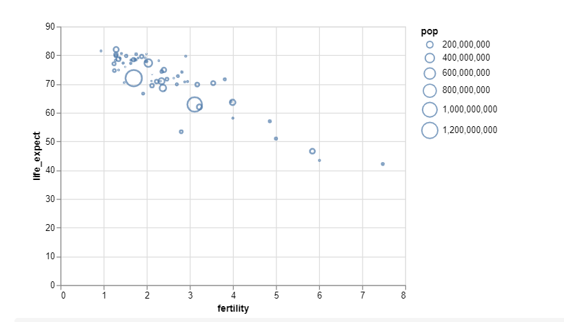

## chart_05_size_b

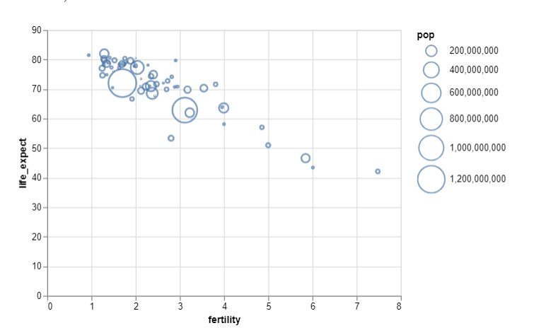

## chart_06_color_a

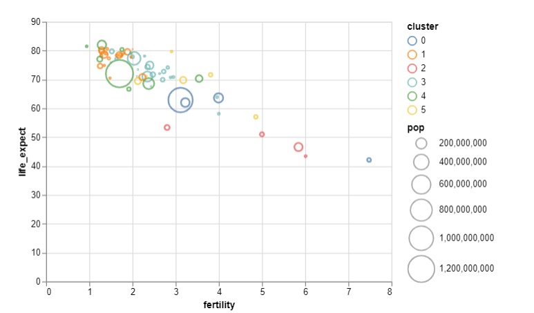

## chart_06_color_b

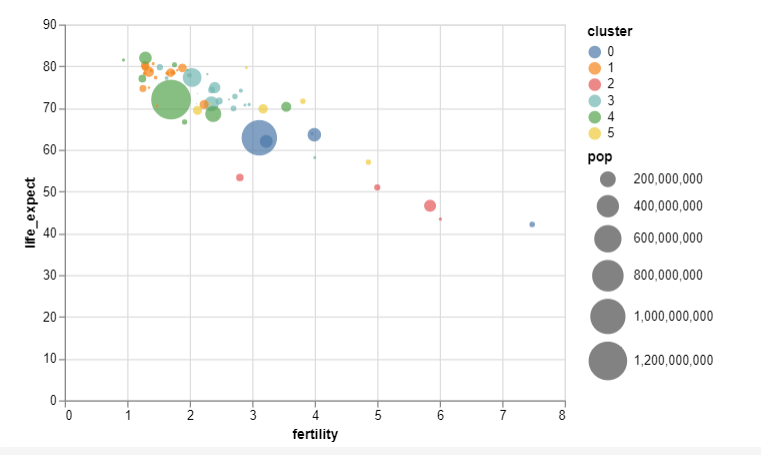

## chart_06_color_c

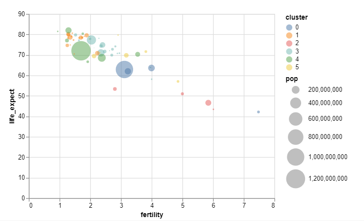

## chart_06_color_d

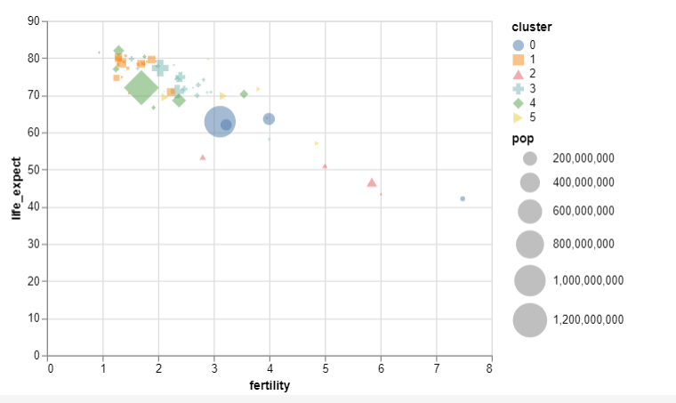

## chart_06_color_tooltip_a

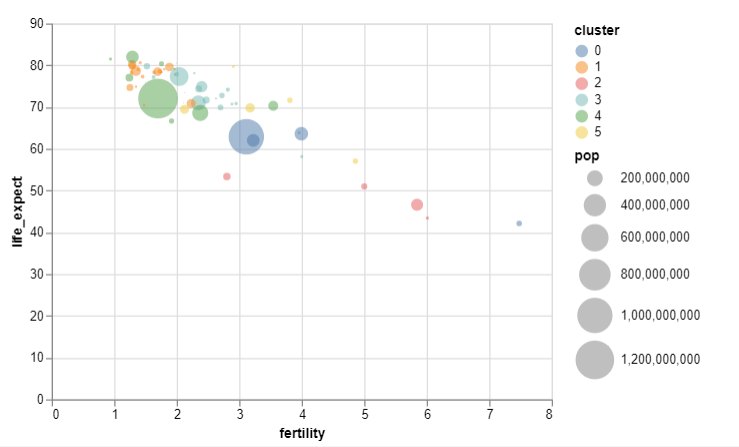

## chart_06_color_tooltip_b

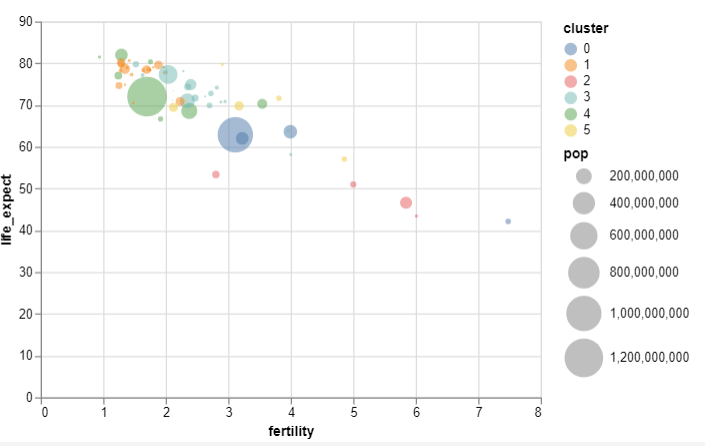

## chart_06_color_tooltip_c

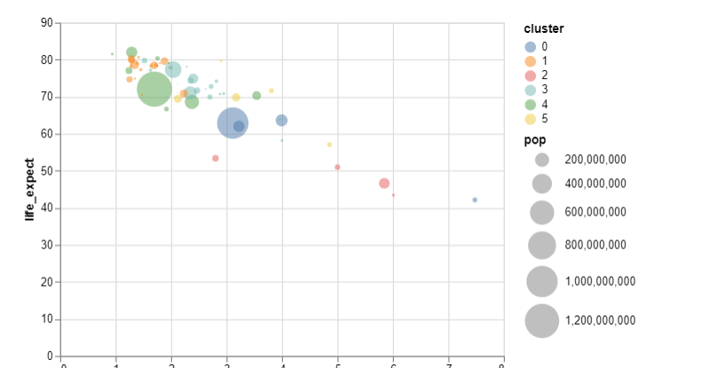

## chart_07_facets_a

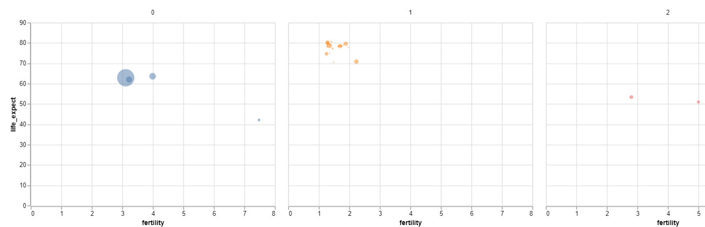

## chart_07_facets_b

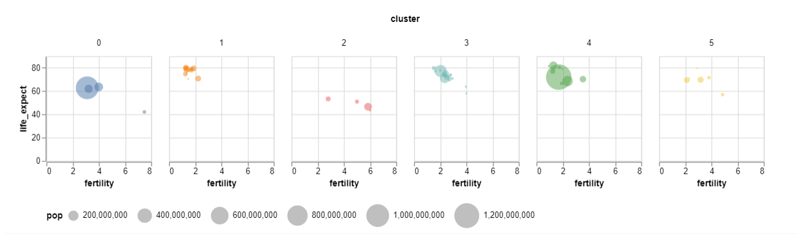

## chart_08_slider

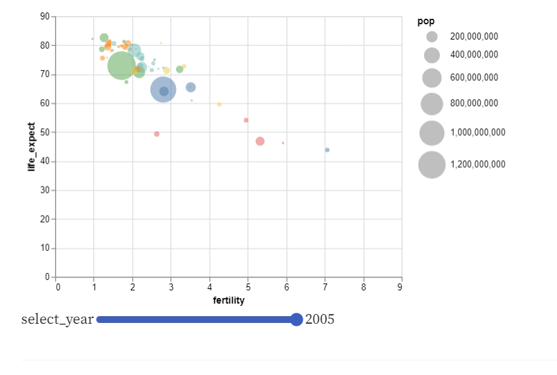

## chart_09_point_mark

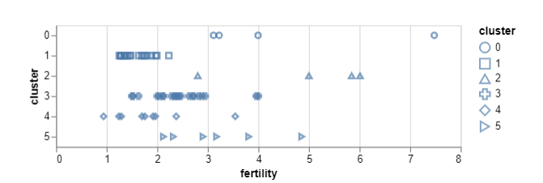

## chart_10_circle_mark

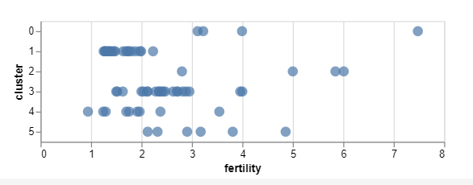

## chart_11_tick_mark

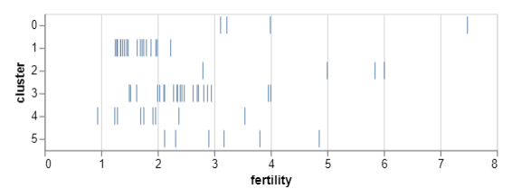

## chart_12_bar_mark_a

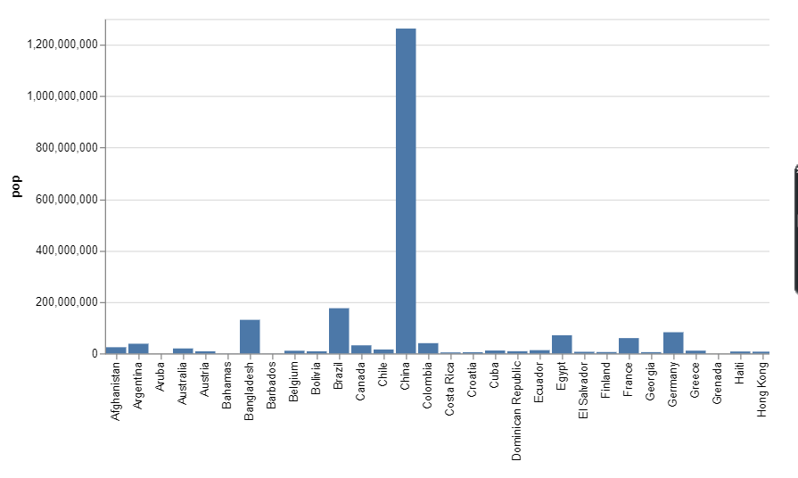

## chart_12_bar_mark_c

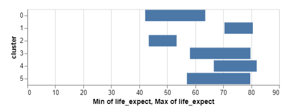

## chart_13_line_mark_a

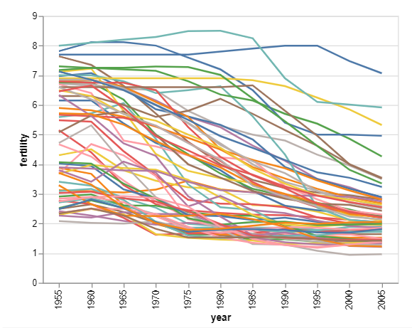

## chart_13_line_mark_b

## chart_13_line_mark_c

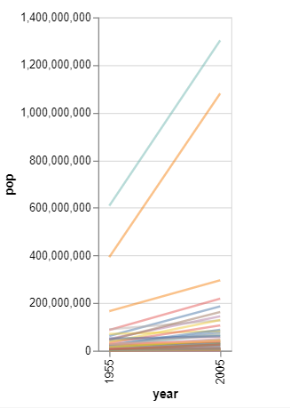

## chart_14_area_mark_a

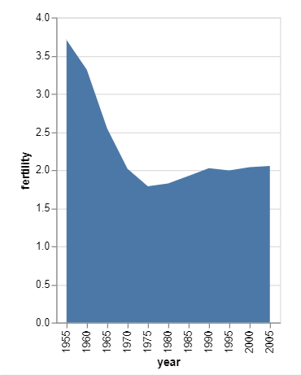

## chart_14_area_mark_b

## chart_14_area_mark_c

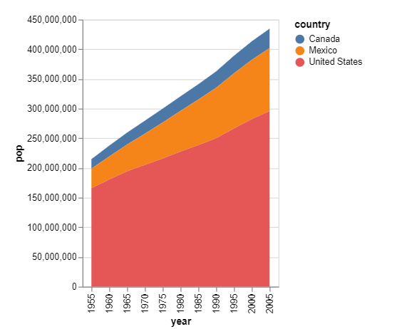

## chart_14_area_mark_d

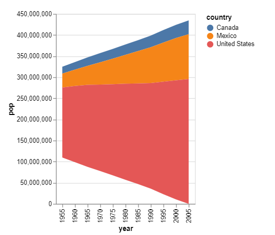

## chart_14_area_mark_e

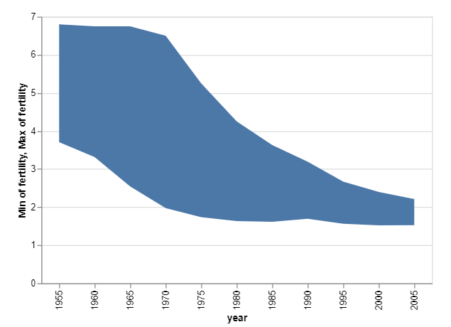

## chart_14_area_mark_f

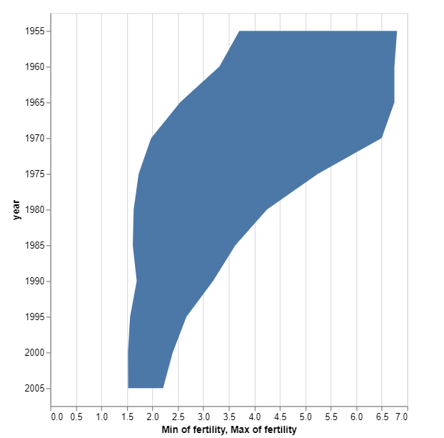
